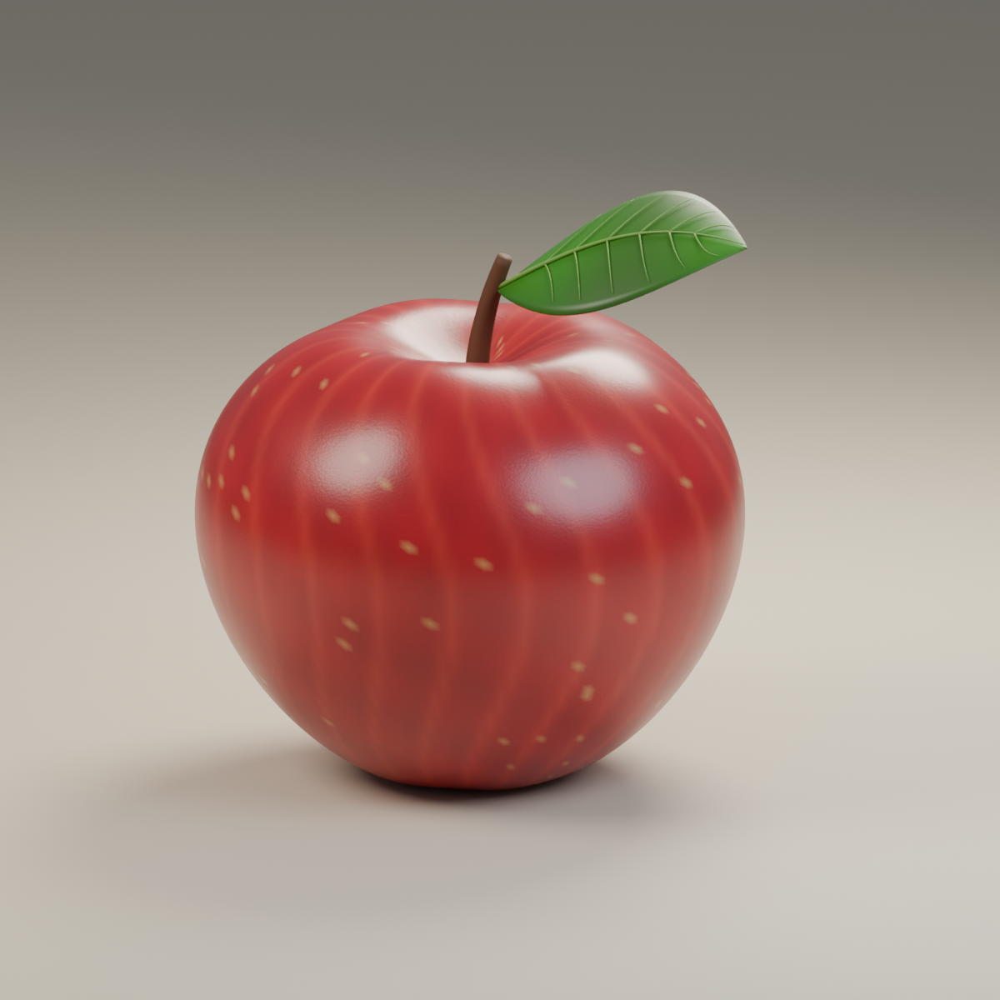

# Blender 苹果 3D：模型、网页与短视频

从 Blender 程序建模开始，将带果梗、叶片和叶脉的苹果导出为 GLB，在 Three.js 静态网页中展示双侧光照，最后制作 10 秒竖屏旋转视频及原创背景音乐。



## 直接查看成果

- **三维网页**：[下载项目](https://github.com/wwlwgo/blender-apple-3d/archive/refs/heads/main.zip)并解压，在现代浏览器中打开 `apple_web/dist/index.html`。模型和 Three.js 已内嵌，可以离线查看。
- **Blender 工程**：[apple.blend](first_apple/apple.blend)。使用 Blender 打开，可编辑果身、果梗、叶片、灯光和相机。
- **网页模型**：[apple.glb](first_apple/apple.glb)。可导入 Three.js 或其他支持 glTF 的软件。
- **带音乐视频**：[apple_10s_vertical_with_music.mp4](apple_video/apple_10s_vertical_with_music.mp4)。
- **无音乐视频**：[apple_10s_vertical.mp4](apple_video/apple_10s_vertical.mp4)。

网页支持拖动旋转、滚轮缩放、自动旋转和独立调节左右灯光。视频采用 1080×1920 竖屏、30 帧/秒，时长 10 秒。背景音乐由项目中的合成脚本生成，带淡入淡出。

## 文件

- `first_apple/apple.blend`：可编辑的完整 Blender 工程，包含苹果和摄影棚。
- `first_apple/apple.glb`：只包含苹果、果梗、叶片及叶脉，供 Three.js 等程序加载。
- `first_apple/apple_preview.png`：通过 Blender 渲染的预览图。
- `create_apple.py`：生成模型、导出文件和渲染图片的 Python 脚本。

模型使用程序生成的网格、顶点颜色和材质，不依赖外部贴图。GLB 保留几何体和基础材质；Blender 的细微程序凹凸及摄影棚灯光效果不包含在 GLB 中，网页里需要自行设置灯光。当前尺寸为创作单位，可按网页场景缩放。

## 打开和操作

双击 `first_apple/apple.blend`，或者在 Blender 中选择 File → Open。

- 中键拖动：旋转视角。
- Shift + 中键拖动：平移视角。
- 滚轮：缩放。
- 按数字小键盘 0，或选择 View → Cameras → Active Camera：切换相机视角。
- 选择 Render → Render Image：重新渲染。

## 用命令重新生成

以下命令会重新生成输出目录中的同名文件；保留手工修改前请先另存工程。

在项目根目录执行（需要安装 Blender 并将其加入 PATH）：

```sh
blender --background --python create_apple.py
```

macOS 默认安装路径也可直接调用：

```sh
/Applications/Blender.app/Contents/MacOS/Blender --background --python create_apple.py
```

## 重新生成网页

需要 Node.js 20 或以上版本：

```sh
cd apple_web
npm ci
npm run build
```

构建结果为 `apple_web/dist/index.html`，无需后端服务。网页操作说明见 [apple_web/README.md](apple_web/README.md)。

## 重新生成视频与音乐

需要 Python 3.9 或以上、FFmpeg，以及上一步安装的网页依赖。从项目根目录执行：

```sh
python3 -m venv .venv
source .venv/bin/activate
pip install -r requirements.txt
python -m playwright install chromium
node apple_web/build_video.mjs
python apple_web/record_video.py
```

录制脚本使用网页中的同一 Three.js 场景逐帧生成 300 张图片，隐藏操作面板，让苹果在固定双侧光照下转一圈。中间帧不纳入仓库。可通过 `PLAYWRIGHT_CHROMIUM_EXECUTABLE` 环境变量指定已有 Chromium 的路径。

合成无音乐视频（`-n` 防止覆盖已有文件；重新生成时请改用新的输出文件名）：

```sh
ffmpeg -n -framerate 30 -i apple_video/frames/frame_%04d.png -frames:v 300 -vf 'scale=out_color_matrix=bt709:out_range=tv,format=yuv420p' -c:v libx264 -preset medium -crf 18 -movflags +faststart apple_video/apple_10s_vertical.mp4
```

生成音乐并添加到视频：

```sh
python apple_video/create_music.py
ffmpeg -n -i apple_video/apple_10s_vertical.mp4 -i apple_video/apple_relaxed_music.wav -map 0:v:0 -map 1:a:0 -c:v copy -af 'loudnorm=I=-20:TP=-2:LRA=7' -c:a aac -b:a 192k -ar 48000 -t 10 -movflags +faststart apple_video/apple_10s_vertical_with_music.mp4
```

## 在已有 Three.js 项目中加载

将 `apple.glb` 放到网站可访问的 `/models/` 目录。下面代码假设已经创建了 `scene`：

```js
import { GLTFLoader } from 'three/addons/loaders/GLTFLoader.js';

const loader = new GLTFLoader();
loader.load('/models/apple.glb', (gltf) => {
  scene.add(gltf.scene);
});
```

还需要设置相机、渲染器和灯光才能看到最终画面。

## 依赖与文件范围

Three.js 使用 MIT 许可证，完整许可文本随静态网页保存在 [THREE-LICENSE.txt](apple_web/dist/THREE-LICENSE.txt)。仓库保留可直接使用的模型、网页和视频；不包含依赖目录、录制中间帧、Blender 自动备份或本地其他项目。
